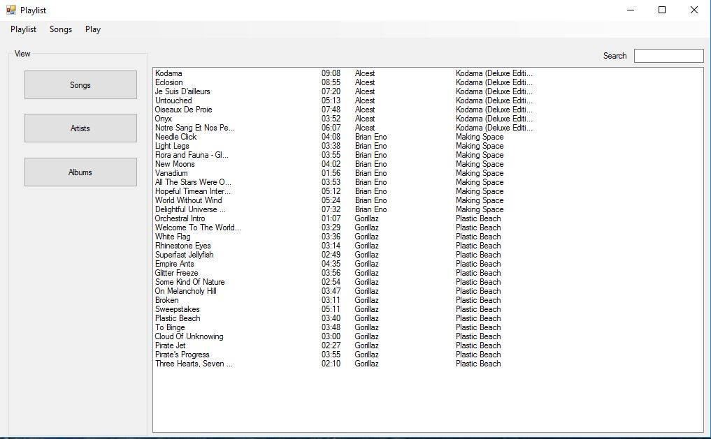

# Music Player

## 1. Опис на апликацијата
Апликацијата е едноставен music player со можност за зачувување на плејлисти

## 2. Упатство на користење
### 2.1. Додавање на една или повеќе песни
Кога ќе се стартува апликацијата од мени барот може да се додаде една или повеќе песни при што истите веднаш почнуваат да свират

### 2.2. Отварање на веќе зачувана плејлиста
Преку мени барот во Music > Open Playlist може да се отвори претходно зачувана плејлиста во меморија

### 2.3. Креирање на плејлиста
Преку мени барот во View > Playlist се отвара прозорецот за креирање на плејлисти при што се можни 3 различни прегледи, по песна, по артист и по албум.

#### 2.3.1. Додавање на песни во плејлистата
Преку мени барот на прозорецот за плејлиста може да се додаде една или повеќе песни

#### 2.3.2. Зачувување на плејлистата
Преку мени барот на прозорецот за плејлиста може да се зачува плејлистата при што се отвара прозорец за избор на име и локација

#### 2.3.3. Пребарување низ плејлистата
Во прозорецот за плејлистата постои контрола за пребарување на песните кои се веќе додадени во плејлистата

#### 2.3.4. Бришење од плејлистата 
Селектираните песни во плејлистата може да се избришат со кликање на копчето `delete` на тастатурата

## 3. Претставување на проблемот
### 3.1. Податочни структури
Постојат 3 класи кои се користат за организирање на песните.
Податоците за авторите се чуваат во класата `Artist`. За секој автор има листа на албуми кои се објекти од класата `Album` и во секој албум има листа на песни кои се објекти од класата `Song`.

За секоја песна се чува жанрот, насловот, редниот број во албумот, артистот и албумот доколку постојат. Се чува и должината на песната и нејзината локација во меморијата.

За секој албум се чува името, листа на песни, кавер сликата доколку постои во истиот директориум и годината на издавање доколку е достапна.

За секој автор се чува името и листата на албуми.

#### 3.2. Playlist
Во објекти од класата `Playlist` се чува и менаџира плејлистата.

##### 3.2.1. Градење на дрвото за приказ на артисти
Во класата `Playlist` е имплементиран методот `ShowArtistsOnTreeView(TreeView treeView)` кој ги прикажува артистите на контролата од тип TreeView.

За секој артист се креира уникатен јазел
```c#
var artistNode = new TreeNode(artist.Name)
                {
                    Name = artist.Name,
                    ImageKey = artist.Name,
                    Tag = artist // Use this for retrieval of artist
                };
```

Доколку постои артистот на тој јазел се додаваат јазлите за албум
```c#
if (artistExists)
                {
                    AddNodeToArtist(artist, treeView);
                }
                else
                {
                    AddNewArtistNode(artistNode, treeView);
                }
```

Потоа истата постапка се повторува и за секој албум на артистот, доколку постои албумот се додава јазел песна на него, доколку не постои се креира и се додава јазел песна.
Во албумот не може да има повеќе песни со исто име.

##### 3.2.2. Пуштање на песна од `Plazlist` во главната форма на player-от
```c#
MainForm_PlayListPlayClicked(object sender, PlaylistPlayClickedEventArgs e):void
```
Оваа метода служи за пуштање на песни од формата `Playlist` во главната форма на player-от. Методата е всушност обработувач на настанот `PlaylistPlayClicked`, односно овој настан се испалува секогаш кога во Playlist формата ќе се стисне копчето за play од menu strip контролата. Аргумент за овој обработувач на настан е објект од класата `PlaylistPlayClickedEventArgs`, каде што како својство се содржат сите песни кои треба да бидат пуштени.

Потоа сите песни се предаваат на контролерот (класата `Player`), каде што се обработуваат како музички податоци.

#### 3.3. Пуштање на песни
За да се пушти песна ја користиме готовата метода од `Windows Media Player`. Пред да се пушти една песна прво се создава објект од класата `MusicFile` за истата во која се чува локацијата на песната и локацијата на сликата за албумот.

### 4. Слики



